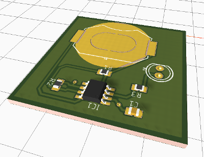

*********************
League-EE-Blinky555
*********************

.. contents:: Table of Contents

Summary 
=========

These are the Eagle CAD files for the  555 timer, including schematic, board layout, and *most importantly, a custom Eagle library* so you don't have to go searching through thousands of parts.

Installation
====================

Install the Library
---------------------

This was the most confusing part. Eagle does not make it obvious at all how to add a library.

**(This needs to be updated!)**

1. Copy the *League_555_Blinky.lbr* file to the *lbr/* directory
2. Go to Library Manager and ???
3. Click on [Browse] button and navigate to the *League_555_Blinky.lbr* file
4. Click on Open

Copy the Project Files (Optional)
-----------------------------------

Create a folder where Eagle projects are stored. This is usually a different folder from the
program files.

Copy the .sch (schematic) and .brd (board file) into the new folder.

Laying Out
===========

Warning: Either the stop mask must be opened up underneath the coin cell or a solder blob
placed on the bottom pad to contact the bottom of the coin cell.

The example file includes a ground filled polygon.

Example Circuit
=================

**(Circuit not tested; the values were guessed at. Needs need updating.)**

(Add drawing)

BOM (Bill of Materials)
========================

* Resistor, ?k, 0805, 2 pcs
* Capacitor, ?uF, 0805, 1 pc
* LED, 5 mm
* Timer IC, LM555
* Coin cell

  * CR1220 -- 12 mm diameter, 2 mm thick
  * CR2032 -- 20 mm diameter, 3.2 mm thick
  
* Coin cell holder, to match coin cell

  * CR1220 type -- Keystone, 3000
  * CR2032 type -- Linx Technologies, 712-BAT-HLD-001 

Recommended Reference Tutorials
================================

(Add links to best Eagle tutorials on the web; good for both instructors and kids as a reference.)

Ideas for Improvements
======================
* **Update the actual component values before ordering parts!**
* Add a potentiometer so the kids can adjust the blink rate
* Consider a speaker output and make this an oscillator/tone generator
