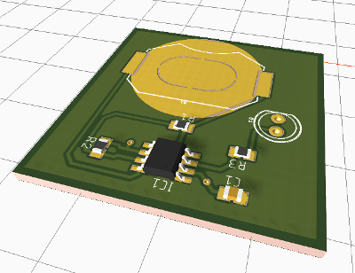

# League-EE-Blinky555

## Summary 

This project creates a circuit board with a flashing LED using a 555 timer IC.

This project spans for several sessions and will teach:

* Ohms Law and basic electronics
* How the 555 timer works
* Creating a schematic with Eagle
* Creating a printed circuit board with Eagle
* Soldering skills

## Eagle

See the section on [Eagle](Eagle/) for details.

    
## Lesson Plan

The [Lesson Plan](Lesson%20Plan/) folder has the formatted lesson plan

## LTspice

LTspice is a circuit simulator and can be incorporated into a future lesson. Simulation
files for the Blinky555 circuit are in the [LTSpice](LTSpice/) folder.
